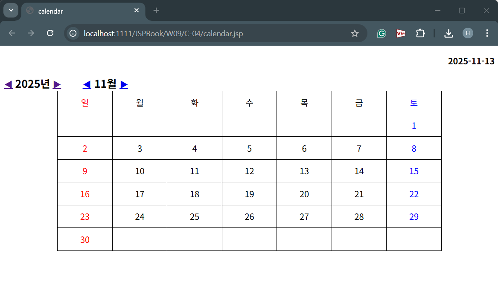

# portfolio
안녕하세요. 동덕여대 HCI사이언스 / 컴퓨터학 복수전공 중인 최혜선입니다.  
아래는 제가 진행한 개발 프로젝트들을 정리한 포트폴리오입니다.

## 1. JSP 달력 웹페이지
- HTML, CSS, JSP를 활용하여 사용자가 입력한 연도와 월에 따라 달력을 자동으로 생성하는 웹페이지
- **기능:** 사용자가 원하는 연도와 월로 이동, 일정을 등록
- **기술스택:** Java (JSP), HTML, CSS  
- **개발환경:** Eclipse, Apache Tomcat  
- **상태:** 기본 동작 구현 중
- **웹페이지실행화면:**   
  
## 2. Unity 2D 플랫포머 게임 (Pixel Dash: Keys & Coins)
- Unity 2D를 활용하여 제작한 플랫포머 게임  
- **설명:** 플레이어가 점프와 이동을 통해 장애물을 피하고, 열쇠·코인을 수집하며 스테이지를 클리어하는 구조  
- **기능:** 캐릭터 이동 및 점프, 아이템 수집, 게임오버/클리어 UI, 타이머, 점수, 체력   
- **기술스택:** C#
- **개발환경:** Unity
- **게임설명영상:** (https://drive.google.com/file/d/1HX0k3_Wo5zf83SJ23M7BdbMj3W6iSiLa/view?usp=sharing) [Google Drive]

## 3. 발전 계획
- Unity 게임 → 웹페이지로 게임 소개 페이지 제작
